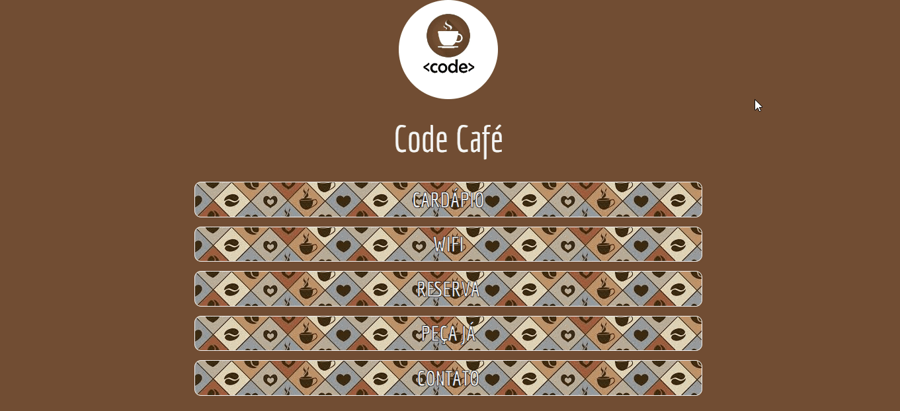

# Code Café
## Desafio

Criar uma página de uma cafeteria com links, em formato LinkTree.

## Tecnologias aplicadas

* HTML
* CSS

## Conceitos aplicados

* Conceito display-flex.
* Customização de fonte com Google Fonts, cor, tamanho e contorno.
* Aplicação de imagens como logotipo, e dentro do box com link.
* Customização de borda, com border-radius.
* Aplicação de Link para outros recursos do site.
* Aplicação de efeito :hover ao clicar no link.

## Autores

- [@isisgoncalves](https://www.github.com/isisgoncalves)

## 🚀 Sobre mim
Sou desenvolvedora front-end. 
Atualmente trabalho com HTML e CSS, sendo JS meu próximo tópico de estudo.

## Demonstração

<h1 align="center"> 
  
</h1>

## :open_file_folder: O que acha de acessar o projeto? 
Você pode acessar o projeto clicando [aqui](https://isisgoncalves.github.io/linktree/).